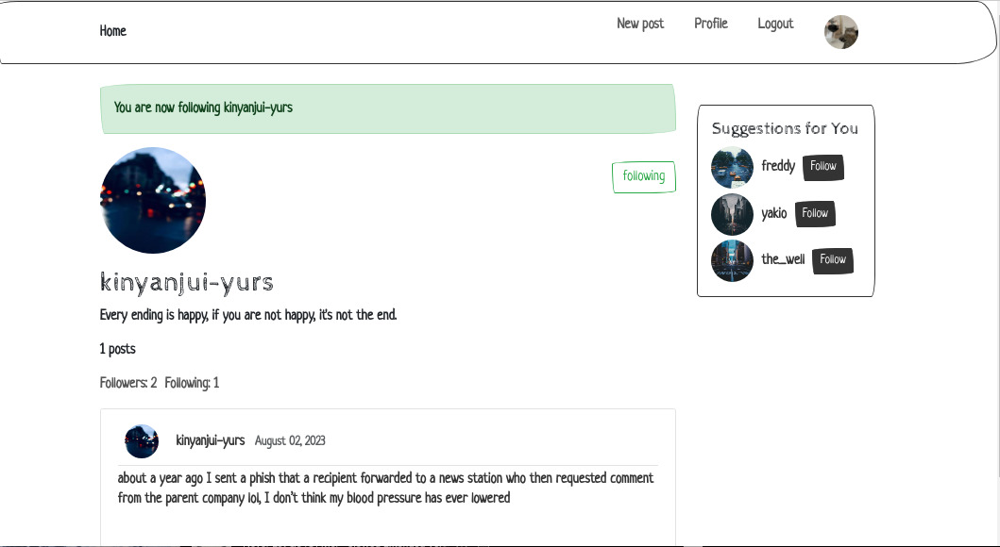

# 🐍 Python Django Social Media Project

This is a social media project developed with Python Django,

🚧 Feature-rich social media application using Django, allowing users to connect with others, share images, update
profiles, and manage their content


## 📷 screenshots
 
 
 
## 🚀 Getting Started

To get started, clone the repository:

```
 git clone  https://github.com/jck-bit/A-social-media-app-in-Django.git
```
cd into the project
```
cd + name of project
```
install dependancies
```
  pip install -r requirements.txt
```
run

```
 python3 manage.py
```

You can then access the server at http://localhost:8000.

## 📝 Usage

Once the development server is running, you can sign up for an account and start creating and editing posts. You can also edit your profile to add a profile picture, bio, and other information.

## 🛠️ Technologies & Tools Used

- Python3
- Django
- CSS 3
- PostgreSQL
- Docker
